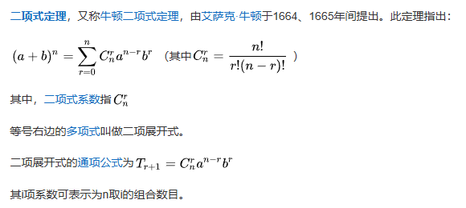

# 一、乘法公式

## 一、乘法公式及其推广

平方差公式
$$
(a²-b²)=(a+b)(a-b)
$$
[注]根式有理化
$$
\because \quad (a²-b²)=(a+b)(a-b)\\
\therefore \quad a-b=(\sqrt a+\sqrt b)+(\sqrt a-\sqrt b)\\
\therefore \quad \sqrt a-\sqrt b=\frac{a-b}{\sqrt a + \sqrt b}
$$
立方差公式
$$
a^3-b^3=(a-b)(a^2+ab+b^2)
$$
立方和公式
$$
a^3+b^3=(a+b)(a^2-ab+b^2)
$$
四次方差公式
$$
a^4-b^4=(a-b)(a+b)(a^2+b^2)
$$
五次方差公式
$$
a^5-b^5=(a-b)(a^4+a^3b+a^2b^2+ab^3+b^4)
$$
推广：

（1）当n为正整数时
$$
a^n-b^n=(a-b)(a^{n-1}+a^{n-2}b+a^{n-3}b^2+...+ab^{n-2}+b^{n-1})
$$
（2）当n为正奇数时
$$
a^n+b^n=(a+b)(a^{n-1}-a^{n-2}b+a^{n-3}b^2+...-ab^{n-2}+b^{n-1})
$$
完全平方公式
$$
（a+b)^2=a^2+2ab+b^2\\
(a-b)^2=a^2-2ab+b^2
$$
多项式平方公式
$$
(a+b+c)^2=a^2+b^2+c^2+2ab+2ac+2bc
$$
注:多项式的平方等于各项的平方和，加上每两项积的2倍

完全立方公式
$$
(a+b)^3=a^3+3a^2b+3ab^2+b^3\\
(a-b)^3=a^3-3a^2b+3ab^2-b^3
$$
二项式展开

重要：
$$
a^3+b^3+c^3-3abc=(a+b+c)(a^2+b^2+c^2-ab-ac-bc)\\
=(a+b+c) \frac{1}{2}[(a-b)^2+(b-c)^2+(c-a)^2]
$$

## 二、乘法公式变形的应用

完全平方公式变形
$$
a^2+b^2=(a+b)^2-2ab\\
(a-b)^2=(a+b)^2-4ab\\
(a+b)^2-(a-b)^2=4ab\\
(a+b)^2+(a-b)^2=2(a^2+b^2)
$$
完全立方公式变形
$$
(a+b)^3=a^3+b^3+3a^2b+3ab^2=a^3+b^3+3ab(a+b)\\
(a-b)^3=a^3-b^3-3a^2b+3ab^2=a^3-b^3-3ab(a-b)
$$
重要：
$$
ab+bc+ca=\frac{1}{2}[(a+b+c)^2-(a^2+b^2+c^2)]
$$

# 二、分式与根式

## 一、分式的基本概念和性质

$\frac{A}{B}$称为分式，其中A,B表示整式，若A与B没有公因子，称为最简分式

## 二、分式的基本运算

$$
\frac{A}{B}=\frac{A\cdot M}{B\cdot M}\\
\frac{A}{B}=\frac{\frac{A}{M}}{\frac{A}{M}}\\
(M\neq 0)
$$

$$
\frac{A}{B}\pm\frac{C}{D}=\frac{AD\pm BC}{BD}\\
\frac{A}{B}\times\frac{C}{D}=\frac{AC}{BD}\\
\frac{A}{B}\div\frac{C}{D}=\frac{AD}{BC}\\
(\frac{A}{B})^n=\frac{A^n}{B^n}
$$
注：分母不为0分式才有意义，判断分式是否有意义时不能先约分，不能先化简；当分子为0分母不为0时，分式的值为0

## 三、分式对称计算技巧

（1）$\frac{A+B}{AB}=\frac{A}{AB}+\frac{B}{AB}=\frac{1}{A}+\frac{1}{B}$

（2）$\frac{AB}{A+B}=\frac{1}{\frac{A+B}{AB}}=\frac{1}{\frac{1}{A}+\frac{1}{B}}$

## 四、根式

### 定义:

$\sqrt{a}$被称为二次根式，$\sqrt[3]{a}$被称为三次根式，偶数次根式必须大于0

### 结论:

(1)当$a\geq0$时，$a^{\frac{1}{n}}=\sqrt[n]{a}$,称为算数根

(2)$(\sqrt[n]{a})^n$，当n为偶数时，$a\geq0$，当n为奇数时，a不做要求

(3)$(\sqrt[n]{a^n})=\begin{cases}a,a\geq0 \\ -a,a<0\end{cases}$

[注]$\sqrt{a^2}=|a|=\begin{cases}a,a\geq0 \\ -a,a<0\end{cases}$

# 四、一元一次方程、一元二次方程和分式方程

## 一、一元一次方程（同解方程 $ax+b=0(a\neq0)$

（1）方程两边同时加上(减去)同一个整式

（2）方程两边同时乘以(除以)同一个非零整式

与原方程同解

## 二、绝对值运算

$$
|a|=\begin{cases}a,a\geq0 \\ 0,a=0\\-a,a<0\end{cases}
$$

## 三、一元二次方程

### 一、定义

$ax^2+bx+c=0(a\neq0)$

1.$\Delta=b^2-4ac>0\to x_{1,2}=\frac{-b\pm\sqrt{b^2-4ac}}{2a}$ 

2.$\Delta=b^2-4ac=0\to x_{1,2}=-\frac{b}{2a}$ 

3.$\Delta=b^2-4ac<0\to x_{1,2}=\alpha\pm i\beta$ (复根，后面会讲)

### 二、韦达定理

$$
\Delta=b^2-4ac\geq0时\\
x_1+x_2=-\frac{b}{a}\\
x_1 x_2=\frac{c}{a}
$$

## 四、分式方程

（1）通分

（2）换元

（3）裂项技巧$\frac{1}{x(x+1)}=\frac{1}{x}-\frac{1}{x+1}$

分式方程没有特别的定义，主要要注意解题过程中通分和换元的技巧

# 三、函数概念和二次函数

# 四、指数函数和对数函数

# 五、等差数列和等比数列

# 六、数学归纳法

# 七、三角函数及其性质

# 八、三角函数公式

# 九、反三角函数

# 复数初步